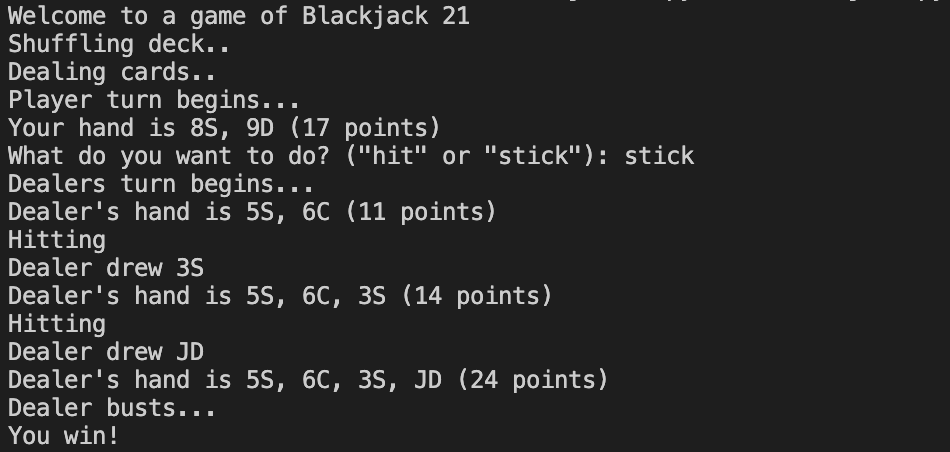

# Simple One-Player Blackjack Game

## Overview

In this project, I've built a simple one-player Blackjack game that can be played in the command line with the following functionality:

- Generate a deck of cards
- Randomize a deck of cards
- Play a full game, taking input from a user
- Simulate a dealer's turn
- Decide who has won the game

The game follows the rules of a variant of Blackjack called French/German Blackjack, which is slightly simpler than traditional Blackjack.

##### Example game - Player Win


## Getting Started

To get started with the game, follow these steps:

1. Clone the repository to your local machine:

```bash
git clone https://github.com/rhkashif/Blackjack.git
```

2. Navigate to the project directory:

```bash
cd blackjack
```

3. Run the game:
```bash
python blackjack.py
```

## Gameplay

- The game begins by shuffling the deck and dealing two cards to the player.
- The player takes their turn, deciding whether to "hit" (draw another card) or "stick" (end their turn).
- If the player's hand exceeds 21 points, they bust and lose.
- After the player's turn, the dealer takes their turn until they reach at least 17 points.
- The game then determines the winner based on the final scores.

## Custom Seed (Optional)

You can specify a custom seed to ensure consistent card shuffling for testing purposes. Use the --seed option when running the game:

```bash
python blackjack.py --seed 313131
```

## Rules

-Aces are worth 11 points.
-Number cards are worth their face value.
-Face cards (Jacks, Queens, Kings) are worth 10 points.
-The goal is to have a hand value as close to 21 as possible without exceeding it.

## Testing

I have a comprehensive test suite to ensure the functionality and reliability of the one-player Blackjack game. I have used [pytest](https://pytest.org/) as my testing framework.

To run the tests locally, follow these steps:

1. Make sure you have Python and pytest installed on your system.
2. Open your terminal or command prompt.
3. Navigate to the project's root directory.
4. Run the following command:

```bash
pytest test_blackjack_coaches.py
pytest test_blackjack_trainees.py
```

## Contributing

I welcome contributions to this project. Feel free to open issues, suggest improvements, or submit pull requests. Please follow best practices and contribute in a constructive manner.

